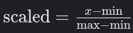
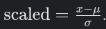

# **Different Techniques**
	- ## **What is Data preprocessing**
	  collapsed:: true
		- This is a crucial and initial part of the for the machine learning model training , improving the models accuracy by cleaning and structuring data
		- Data preprocessing prepares raw data for machine learning by addressing issues like missing values and inconsistent scales. It’s essential to ensure models perform well, and it’s typically done before applying algorithms.
			- ### **Common Techniques**
				- Handling missing values
				- Data cleaning
				- Transformation
				- feature selection
				- Feature engineering
				- splitting
		- The most used libraries for all the above tasks are Pandas , Numpy and Scikit-learn for preprocessing
	- ## **Detailed Processing Techniques**
		- ### **Handling Missing Values**
		  collapsed:: true
			- This technique involves identifying and addressing missing data points in the dataset, which can lead to biased or inaccurate models if ignored.
				- **When to Use:** Use deletion when the amount of missing data is small and not critical. Use imputation when preserving data is important, especially for large datasets, to maintain statistical power
			- **Deletion:** Remove rows or columns with missing values. This is simple but can result in significant data loss, making it less ideal for datasets with substantial missing data
			- **Imputation**: Fill missing values with estimated values, such as:
				- Mean, median, or mode imputation, where missing values are replaced with the average, middle, or most frequent value of the column.
				- Advanced methods like K-Nearest Neighbors (KNN) imputation, which estimates missing values based on similar data points.
		- ### **Data Transformation**
		  collapsed:: true
			- This involves converting data into a format suitable for ML algorithms, often focusing on encoding categorical variables and scaling numerical features.
			- **Encoding Categorical Variables:**
				- **Label Encoding:** Convert categories into numerical labels (e.g., 'red' -> 0, 'green' -> 1). Suitable for ordinal data where order matters.
				- **One-Hot Encoding:** Create binary columns for each category (e.g., 'color_red', 'color_green'), ideal for nominal data where no order exist
				- **Scaling:** Scaling changes the range of your data so all numbers fit within a specific range, like squeezing or stretching them to match a standard size
					- Some machine learning models (like k-Nearest Neighbors or Neural Networks) care about the distance between numbers. If one feature has huge values (like salaries in thousands) and another has tiny ones (like ages), the model might focus too much on the big numbers and ignore the small ones. Scaling fixes this by making all features “equally important.”
						- **Min-Max Scaling:** Scales data to a fixed range, typically [0, 1], using the formula .Useful for algorithms requiring bounded inputs.
							- This squishes your data into a range, usually between 0 and 1.
							- 
						- **Standardization:**This adjusts your data so it has an average of 0 and a standard spread (like 1). It’s like centering the data around zero.
							- Example: If ages have an average of 50, standardization might turn 50 into 0, 60 into a positive number, and 40 into a negative number, based on how far they are from the average.
								- 
				- **When to Use:** Use encoding when dealing with categorical variables, as most ML algorithms require numerical input. Use scaling when features have different scales, especially for algorithms sensitive to distance metrics
		- ### **Feature Selection**
		  collapsed:: true
			- **Feature selection** is the process of choosing the most important and relevant input variables (features) from your data to build a machine learning model. The goal is to keep only the features that help the model make accurate predictions and remove those that are 
			  redundant or add noise, making the model simpler and faster
				- **Recursive Feature Elimination (RFE)**, where the model is trained repeatedly, each time removing the least important feature, until only the best set remains .For example, using RFE with a linear regression model, you might start with all features, remove the one with the smallest impact, retrain, and repeat until you have the most useful features for prediction.
		- ### **Feature Engineering**
		  collapsed:: true
			- Featuring is creating new features from existing ones to capture additional information and improve the models performance
				- **Binning:** Convert continuous variables into discrete bins (e.g., age groups like 0-18, 19-30), helpful for non-linear models.
				- **Polynomial features**: are new columns you create by multiplying or combining your existing features together. This helps your model find and learn more complex patterns in the data that aren’t just straight lines.
			- **When to Use:** Use when existing features are insufficient or when domain knowledge suggests new features could improve predictions, common in domains like finance or healthcare.
		- ### **Data Splitting**
		  collapsed:: true
			- Dividing the dataset into training, validation, and test sets to evaluate model performance on unseen data
				- **Random Split:** Randomly divide the data, typically into training (~70-80%), validation (~10-15%), and test (~10-15%) sets.
				- **Stratified Split:** Ensure the same proportion of classes in each split, crucial for classification problems to maintain class balance.
				  id:: 6831ab55-80a2-456f-ad85-4c15f04a0344
			- **When to Use:** Always performed before training any model to assess generalization ability and prevent overfitting.
-