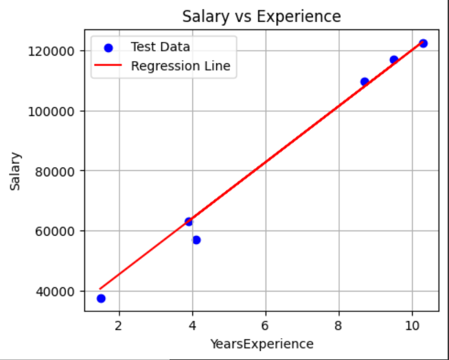
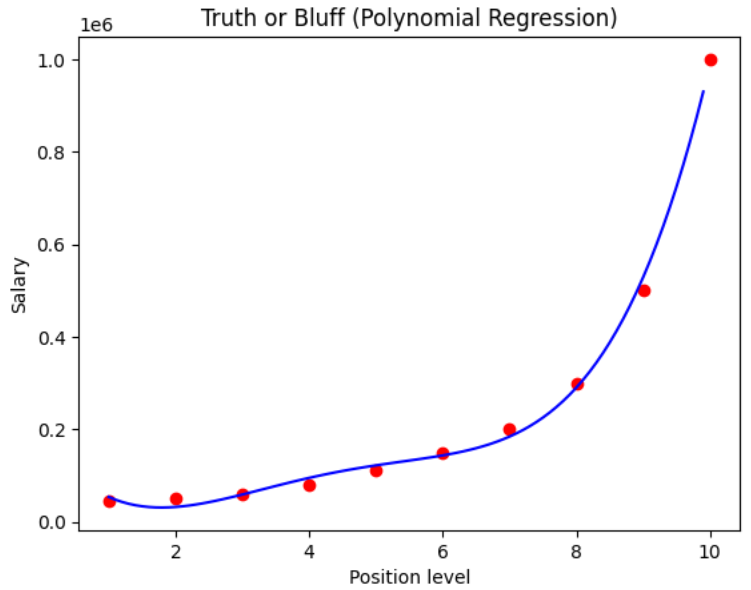
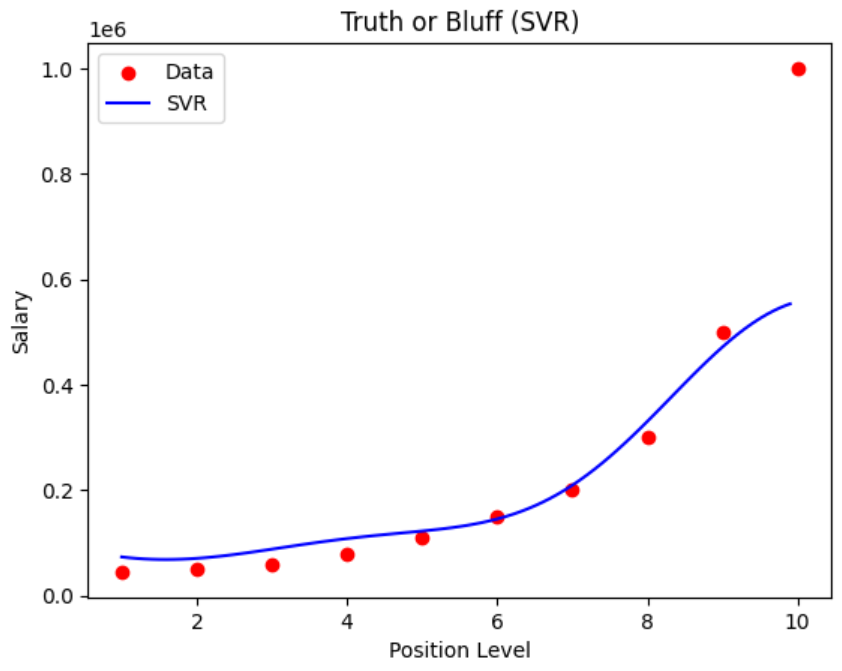

## **Linear Regression**
collapsed:: true
	- ```python
	  class Regression:
	  
	      def __init__(self ,test_size=0.2, random_state=0):
	  
	        self.test_size = test_size
	        self.random_state = random_state
	        self.model = LinearRegression ()
	  
	        # We need to assign None 
	        # it indicates that they are ready to inherit any value later
	  
	        self.X_test = None
	        self.X_train = None
	        self.y_test = None
	        self.y_train = None
	  
	      def split_data(self, dataset):
	  
	          X = dataset.iloc[ : , : -1].values
	          y = dataset.iloc[ : , -1].values
	  
	          self.X_train, self.X_test, self.y_train, self.y_test = train_test_split(X, y, 
	                           test_size = self.test_size, random_state = self.random_state)
	  
	      def train(self):
	          self.model.fit(self.X_train, self.y_train)
	          return self.model
	  
	      def get_model(self):
	          return self.model
	  
	  
	  def run_model(data):
	  
	      lr_model = Regression(test_size=0.2, random_state=0)
	      lr_model.split_data(data)
	      lr_model.train()
	  
	      X_test = lr_model.X_test.flatten() 
	      y_test = lr_model.y_test
	  
	      y_pred = lr_model.get_model().predict(lr_model.X_test)
	  
	  
	      plt.figure(figsize=(5, 4))
	      plt.scatter(X_test, y_test, color='blue', label='Test Data')
	      plt.plot(X_test, y_pred, color='red', label='Regression Line')
	      plt.xlabel('YearsExperience')
	      plt.ylabel('Salary')
	      plt.title('Salary vs Experience')
	      plt.legend()
	      plt.grid(True)
	  
	      plt.show()
	  
	      return lr_model
	  
	  
	  if __name__ == "__main__":
	  
	    dataset = pd.read_csv('/content/Salary_Data.csv')
	    lr_model = Regression(test_size=0.2, random_state=0)
	    model = run_model(dataset)  # Call method
	    print("Slope:", model.get_model().coef_)
	    print("Intercept:", model.get_model().intercept_)
	  
	  
	  ```
		- ### **OUTPUT**
			- ```
			  Slope: [9312.57512673]
			  Intercept: 26780.09915062818
			  ```
			- 
-
- ## **Multi Linear Regression**
  collapsed:: true
	- ```python
	  class MultiLinear:
	  
	    def __init__(self , test_size = 0.2 , random_state = 0 ):
	  
	        self.test_size = test_size
	        self.random_state = random_state
	        self.model = LinearRegression()
	  
	        self.X_train = None
	        self.X_test = None
	        self.y_train = None
	        self.y_test = None
	        
	  
	    def encoder(self ,X):
	  
	        ct = ColumnTransformer(
	              transformers=[('encoder', OneHotEncoder(), [3])],
	              remainder= 'passthrough' )
	        
	        X = np.array(ct.fit_transform(X))
	  
	        return X
	    
	  
	    def traintest(self,X,y):
	        X_train, X_test, y_train, y_test = train_test_split(X, y, test_size = self.test_size,
	                                                              random_state = self.random_state)
	        return X_train, X_test, y_train, y_test
	      
	      
	    def split(self , data):
	  
	        X = data.iloc[ : , : -1].values
	        y = data.iloc[ : , -1].values
	        
	        X = self.encoder(X)
	        self.X_train, self.X_test, self.y_train, self.y_test = self.traintest(X, y)
	  
	          
	    def prediction(self):
	  
	        self.model.fit(self.X_train, self.y_train)
	        y_pred = self.model.predict(self.X_test)
	      
	        return (np.concatenate((y_pred.reshape(len(y_pred),1), self.y_test.reshape(len(self.y_test),1)),1))
	  
	  
	  
	  def run_model(data):
	  
	      mlr_model = MultiLinear(test_size=0.2, random_state=0)
	      mlr_model.split(data)
	      pred_actual = mlr_model.prediction()
	  
	      pred_actual_df = pd.DataFrame(pred_actual, columns=['Predicted Profit', 'Actual Profit'])
	      print("\nPredictions vs Actual Values:")
	      print(pred_actual_df.round(2))
	  
	  
	      return mlr_model, pred_actual
	  
	  
	  
	  if __name__ == "__main__":
	  
	    dataset = pd.read_csv('/content/50_Startups.csv')
	    model = run_model(dataset)
	   
	  ```
		- ###  **OUTPUT**
			- ```
			  Predictions vs Actual Values:
			     Predicted Profit  Actual Profit
			  0         103015.20      103282.38
			  1         132582.28      144259.40
			  2         132447.74      146121.95
			  3          71976.10       77798.83
			  4         178537.48      191050.39
			  5         116161.24      105008.31
			  6          67851.69       81229.06
			  7          98791.73       97483.56
			  8         113969.44      110352.25
			  9         167921.07      166187.94
			  ```
-
- ## **Polynomial Regression**
  collapsed:: true
	- ```python
	  class ploynomialRegression:
	  
	    def __init__(self , degree = 4):
	      
	      self.model = LinearRegression()
	      self.poly_reg = PolynomialFeatures(degree)
	  
	      self.X = None  
	      self.y = None
	  
	  
	    def split(self,data):
	        self.X = data.iloc[ : , 1 : -1].values
	        self.y = data.iloc[ : , -1].values
	  
	  
	    def prediction(self):
	        X_poly = self.poly_reg.fit_transform(self.X)
	        self.model.fit(X_poly, self.y)
	  
	        return self.model
	  
	  
	    def plot(self):
	       
	        X_grid = np.arange(min(self.X[:, 0]), max(self.X[:, 0]), 0.1)
	        X_grid = X_grid.reshape((len(X_grid), 1))
	        plt.scatter(self.X, self.y, color='red')
	        plt.plot(X_grid, self.model.predict(self.poly_reg.fit_transform(X_grid)), color='blue')
	        plt.title('Truth or Bluff (Polynomial Regression)')
	        plt.xlabel('Position level')
	        plt.ylabel('Salary')
	        plt.show()
	  
	  def run_model(data):
	  
	    plr = ploynomialRegression(degree=4)
	    plr.split(data)
	    pred_actual = plr.prediction()
	    plr.plot()
	    return plr
	  
	  if __name__ == "__main__":
	  
	    dataset = pd.read_csv('/content/Position_Salaries.csv')
	    model = run_model(dataset)
	  
	  
	  
	  
	  
	  ```
		- ### **OUTPUT**
			- 
-
- ## **Support Vector Regression**
  collapsed:: true
	- ```python
	  class SupportVectorRegression:
	  
	    def __init__(self):
	  
	      self.sc_x = StandardScaler()
	      self.sc_y = StandardScaler()
	      self.regressor = SVR(kernel = 'rbf')
	  
	      self.X = None
	      self.y = None
	      self
	  
	    def split(self,data):
	  
	      self.X = data.iloc[: , 1:-1].values
	      self.y = data.iloc[: , -1].values
	  
	    def scaling(self):
	      self.X = self.sc_x.fit_transform(self.X)
	      self.y = self.sc_y.fit_transform(self.y.reshape(-1,1)).ravel()
	  
	    def support(self):
	  
	      self.regressor.fit(self.X,self.y)
	      pred =  self.sc_y.inverse_transform(self.regressor.predict(self.sc_x.transform([[6.5]])).reshape(-1,1))
	  
	      return pred
	  
	    def plot(self):
	  
	      X_grid = np.arange(min(self.sc_x.inverse_transform(self.X)), 
	                            max(self.sc_x.inverse_transform(self.X)), 0.1)
	      
	      X_grid = X_grid.reshape((len(X_grid), 1))
	  
	      plt.scatter(self.sc_x.inverse_transform(self.X), 
	                     self.sc_y.inverse_transform(self.y.reshape(-1, 1)), 
	                     color='red', label='Data')
	      
	      plt.plot(X_grid, 
	                  self.sc_y.inverse_transform(
	                      self.regressor.predict(self.sc_x.transform(X_grid)).reshape(-1, 1)), 
	                  color='blue', label='SVR')
	      
	      plt.title('Truth or Bluff (SVR)')
	      plt.xlabel('Position Level')
	      plt.ylabel('Salary')
	      plt.legend()
	      plt.show()
	  
	  
	  def run_model(data):
	  
	    slr = SupportVectorRegression()
	    slr.split(data)
	    slr.scaling()
	    pred = slr.support()
	    slr.plot()
	  
	  
	  if __name__ == "__main__":
	  
	    dataset = pd.read_csv('/content/Position_Salaries.csv')
	    model = run_model(dataset)
	  
	  ```
		- ### **OUTPUT**
			- 
-
- ## **Decision Tree Regression**
  collapsed:: true
	- ```python
	  class tree:
	  
	      def __init__(self,random_state = 0):
	  
	        self.random_state = random_state
	  
	        self.X = None
	        self.y = None 
	        self.regressor = None
	  
	      def split(self,data):
	  
	        self.X =  data.iloc[ : , 1:-1].values
	        self.y = data.iloc[ : , -1].values
	  
	  
	      def des(self):
	  
	        self.regressor = DecisionTreeRegressor(random_state=self.random_state)
	        pred = self.regressor.fit(self.X,self.y)
	  
	        return pred
	        
	      def plot(self):
	  
	        X_grid = np.arange(min(self.X), max(self.X), 0.01)
	        X_grid = X_grid.reshape((len(X_grid), 1))
	        plt.scatter(self.X, self.y, color = 'red')
	        plt.plot(X_grid, self.regressor.predict(X_grid), color = 'blue')
	        plt.title('Truth or Bluff (Decision Tree Regression)')
	        plt.xlabel('Position level')
	        plt.ylabel('Salary')
	        plt.show()
	  
	  
	  def run_model(data):
	  
	    dlr = tree(random_state=0)
	    dlr.split(data)
	    pred = dlr.des()
	    dlr.plot()
	  
	    return dlr
	  
	  
	  if __name__ == "__main__":
	  
	    dataset = pd.read_csv('/content/Position_Salaries.csv')
	    model = run_model(dataset)    
	  
	  
	  
	  ```
		- ### **OUTPUT**
			-
-
- ## **Random Forest Regression**
  collapsed:: true
	- ```python
	  class random:
	  
	      def __init__(self):
	  
	        self.regressor = RandomForestRegressor(n_estimators = 10, random_state = 0)
	        self.X = None
	        self.y = None
	  
	      def split(self,data):
	  
	        self.X = data.iloc[ : , 1 : -1].values
	        self.y = data.iloc[: , -1].values
	  
	  
	      def forest(self):
	        self.regressor.fit(self.X,self.y)
	  
	      def plot(self):
	        X_grid = np.arange(min(self.X), max(self.X), 0.01)
	        X_grid = X_grid.reshape((len(X_grid), 1))
	        plt.scatter(self.X, self.y, color = 'red')
	        plt.plot(X_grid, self.regressor.predict(X_grid), color = 'blue')
	        plt.title('Truth or Bluff (Random Forest Regression)')
	        plt.xlabel('Position level')
	        plt.ylabel('Salary')
	        plt.show()
	  
	  def run_model(data):
	  
	    rfr = random()
	    rfr.split(data)
	    rfr.forest()
	    rfr.plot()
	  
	    return rfr
	      
	  
	  if __name__ == '__main__':
	  
	    dataset = pd.read_csv('/content/Position_Salaries.csv')
	    model = run_model(dataset) 
	  
	  ```